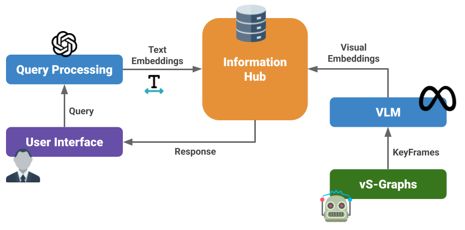

# ⚜️ Sentra ⚜️

<!-- Shields.io Badges -->

[](/docker/README.md)

**Sentra** is a modular, ROS2-based framework that provides a lightweight **Generative AI** core for semantic understanding and question-answering in vS-Graphs. It uses **Vision-Language Models (VLMs)** for extracting visual embeddings and enables context-aware reasoning through a **Retrieval-Augmented Generation (RAG)** pipeline. Sentra is designed to be easily extendable, allowing users to integrate new VLMs and reasoning modules as needed.

## 🧠 Architecture



## 🚀 Getting Started

For installation, you need an **Ubuntu 24.04** system with **ROS2 Jazzy** installed.
Clone the repository and install the required dependencies in the [`requirements.txt`](/sentra_ros/requirements.txt) file.
Then, build the ROS2 workspace using `colcon build` and run the framework using the provided launch files.

```bash
# Clone the repository
git clone git@github.com:snt-arg/sentra.git

# Install Python dependencies
cd sentra && pip3 install --no-cache-dir -r sentra_ros/requirements.txt

# Build the ROS2 workspace
cd ~/workspace
source /opt/ros/$ROS_DISTRO/setup.bash
rosdep install --from-paths src --ignore-src -r -y
colcon build --symlink-install --cmake-args -DCMAKE_BUILD_TYPE=Release

# Run the Sentra framework
source install/setup.bash
ros2 launch sentra_ros sentra.launch.py
```

### 🐋 Docker

For a fully reproducible, environment-independent setup, see the [Docker](/docker) section.

## 📎 Related Repositories

- 🔨 [vS-Graphs](https://github.com/snt-arg/visual_sgraphs)
- 🎞️ Scene Segmentor ([ROS2 Jazzy](https://github.com/snt-arg/scene_segment_ros))
- 🦊 Voxblox Minimal ([ROS2 Jazzy](https://github.com/snt-arg/voxblox_ros2_minimal))

## 🔑 License

This project is licensed under the GPL-3.0 license - see the [LICENSE](/LICENSE) for more details.
